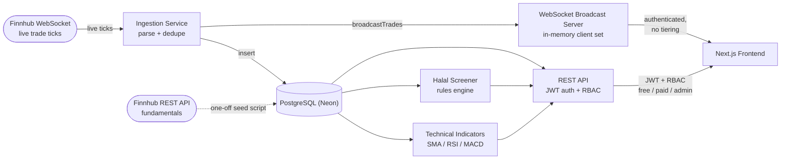
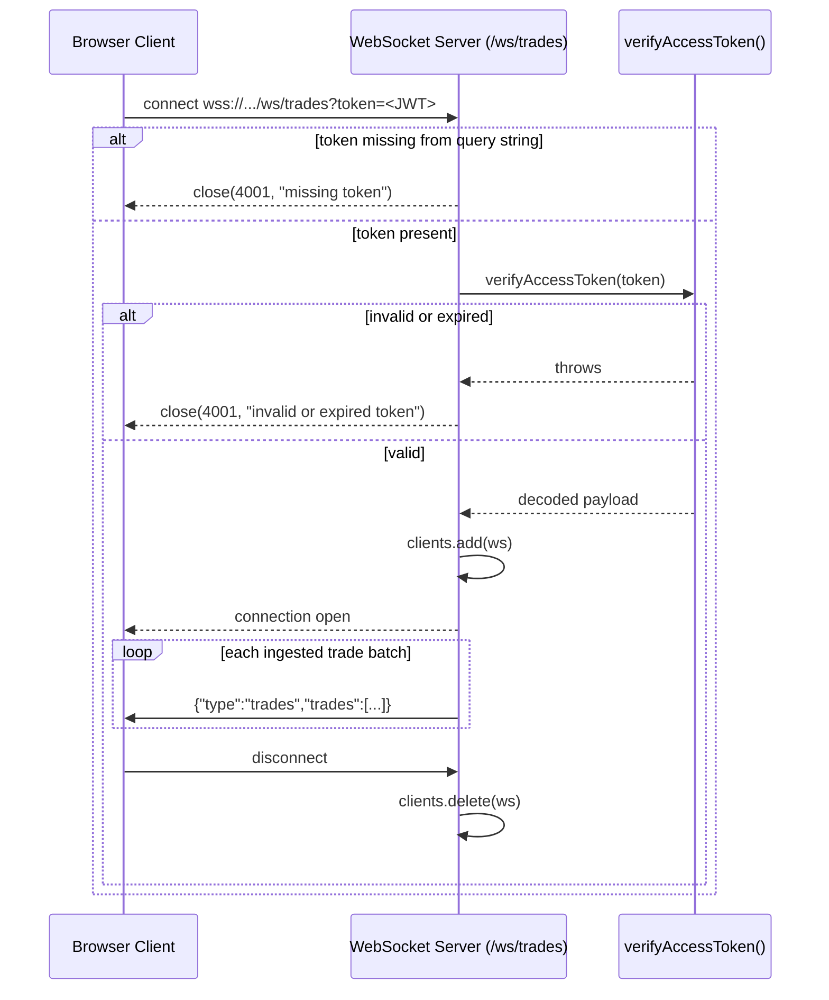

# Market Pulse

A real-time market data platform with live WebSocket price streaming, JWT/RBAC-gated access tiers, and a rules-based halal-compliance screener.

Market Pulse exists to demonstrate real-time systems engineering and access-control design, not trading strategy. The core of the project is a live ingestion pipeline (Finnhub WebSocket → dedup → Postgres → authenticated broadcast) and a proper auth/RBAC layer enforced at both the REST and WebSocket boundary. A secondary feature — technical indicators plus an honestly-evaluated logistic regression model for next-day price direction — exists to show a correct, leakage-free ML methodology, not a working predictor (it isn't one, and the README says so plainly below). A third, smaller feature — a rules-based halal-compliance screener — adds a personal/domain angle on top of the same data.

## Architecture



Two things worth calling out explicitly, since the original design notes mentioned differently:

- **No Redis.** The architecture was originally sketched with Redis/Upstash for pub/sub fan-out between ingestion and the WebSocket layer. It was never built — ingestion and the WebSocket server run in the same Node process, so `broadcastTrades()` just iterates an in-memory `Set<WebSocket>` of connected clients directly. At this scale (one process, a bounded watchlist), a pub/sub layer would be solving a problem that doesn't exist yet.
- **Indicators are computed on demand, not cached.** `GET /indicators/:symbol` reads `price_history` from Postgres and runs SMA/RSI/MACD in the request handler itself. There's no precomputation or caching layer.

## Authenticated WebSocket connection flow



`4001` is a custom application-level close code (the 4000–4999 range is reserved for private use per RFC 6455). Closing with a real code and reason lets the browser's `onclose` handler distinguish "rejected for auth" from a generic connection failure — an HTTP-level rejection at the upgrade handshake doesn't give application code that distinction.

## Features

### Real-time ingestion pipeline

This is the strongest engineering story in the project.

- Connects to Finnhub's WebSocket (`wss://ws.finnhub.io`), subscribes to a watchlist read from the `fundamentals` table at startup — not a hardcoded list, so it can't silently drift from what the rest of the app screens and displays.
- **Reconnect with exponential backoff**: starts at 1s, doubles up to a 30s cap, and only fires on an *unexpected* disconnect — a deliberate shutdown (`stop()` called) is tracked separately and does not trigger a reconnect.
- **Two-layer deduplication**, justified by real captured traffic, not assumed:
  - *Within-message*: a single Finnhub WS frame can carry multiple trades in one `data` array; `dedupeTrades()` collapses exact `symbol:timestamp:price:volume` duplicates within that array.
  - *Cross-message, time-windowed*: real duplicate frames were directly observed arriving as **two separate WebSocket messages**, only ~100ms–1s apart. `checkAndRecordTrade()` keeps a rolling 10-second window of recently-seen trade keys to catch these — 10s gives comfortable margin over the observed gap without holding unbounded state.
- **A real shutdown race, found and fixed during live verification**: `process.exit(0)` in `run.ts` could run ahead of the WebSocket's own `"close"` event, so the ingestion service's shutdown log lines (`connection closed` → `deliberate shutdown` → `summary` → `shutdown complete`) weren't guaranteed to print in order, or at all, before the process exited. Fixed by making `stop()` explicitly `await` a `closeSocketAndWait()` helper that resolves on the socket's real `"close"` event (with a bounded 3-second fallback in case `"close"` never fires) and drains any in-flight database inserts before returning. Verified with **three real 15-second live runs during market hours**: correct log order every time, no timeout fallback triggered, trade counts exact in all three runs, no lingering process afterward.
- Only post-dedup, successfully-inserted records are broadcast to connected clients — not the raw incoming trades.

### Authenticated, tiered access control

- JWT-based auth (`bcrypt`-hashed passwords, signed access tokens) with an RBAC middleware (`requireRole`) enforcing `free` / `paid` / `admin` tiers at the REST layer.
- **Google OAuth as an alternative sign-in method**, alongside password-based auth, verified against a real Google account through the actual consent flow (not mocked): users are matched by `google_id`, not email. A collision with an existing local-password account for the same email is rejected, not silently linked — this project's local registration never verifies email ownership, so merging on email match alone would let anyone claiming an existing user's email via Google OAuth take over that account. The schema backs this with a provider-aware CHECK constraint (`local` requires a password, `google` requires a `google_id`), not a nullable free-for-all that could produce a half-configured row.
- **The live WebSocket stream deliberately has no tiering.** Any authenticated user, any role, gets the same full, immediate trade stream — this was a conscious decision, not an oversight: there's no real business model in this project that would justify gating real-time data, so building differential delay/filtering logic for a paywall that doesn't exist would just be unjustified complexity. RBAC still fully applies elsewhere (REST routes), this decision is scoped specifically to the live broadcast.
- **A real timing side-channel, found and fixed**: the login flow originally short-circuited immediately on "no such user," while "wrong password" always paid the full `bcrypt.compare` cost — meaning response timing could theoretically distinguish the two cases even though both returned an identical generic 401. Fixed by comparing against a fixed, precomputed dummy bcrypt hash on the no-user path, so it pays the same cost every time.
- **JWT staleness is explained, not silently ignored**: because access tokens are stateless and carry the role at issuance, a role change in the database doesn't take effect until the user re-authenticates. Confirmed directly (an already-issued `free`-tier token still 403'd against a paid-gated route immediately after the DB role update, until re-login). This is a deliberate, bounded consequence of the access-token-only design — worst case staleness is capped by the token's 1-hour expiry — not a bug.
- Frontend route protection (`RequireAuth` / `useAuth`) is **client-side only**: it decodes the JWT, checks `exp`, and redirects if missing or expired. This is a deliberate scope choice, not an oversight — the backend enforces auth on every real route regardless, so a bypassed client-side guard can't leak data, only show an empty page shell for a moment before redirecting.

### Technical indicators

SMA, EMA, RSI (Wilder's smoothing — not a plain moving average of gains/losses, a common and subtle mistake this project specifically avoided), and MACD (composed from the same `calculateEMA`, not reimplemented). All are pure functions, unit-verified against hand-computed arithmetic before ever being wired into a route, and now live on the dashboard as real chart overlays (an SMA line on the price chart, RSI and MACD sub-charts with the 30/70 reference bands and a signal/flag-colored histogram) fed by real `price_history` data.

The verification process caught real errors in the external sources used to cross-check the implementation, rather than trusting them blindly:

- An external EMA worked example summed 10 values as 239; hand arithmetic, an independent Node script, and an independent Python script all confirmed the true sum is 240. The corrected value was used, not the flawed source.
- An external 14-day AAPL RSI reference's own "Change" column was cross-checked against its own "Close" column and found to have 3 transcription mismatches — the small residual difference between the implementation's output and the source's stated RSI value was traced precisely to those 3 rows, rather than accepted as "close enough" or assumed to be a bug in the implementation.

### Honest ML pipeline

A next-day price-direction model, built to demonstrate a **correct, leakage-free ML evaluation methodology** — this is explicitly not a working predictor, and oversold as one it wouldn't be.

- Labeled feature dataset (RSI, MACD histogram, price-vs-SMA20, 1-day return, RSI momentum → next-day up/down) built purely from data available at or before each day.
- **Lookahead leakage ruled out two independent ways**, on every row of real data: replacing all future values with `NaN` and confirming identical output, and re-deriving the same feature row from an array structurally truncated to remove the future entirely (not just corrupted — absent).
- **Chronological, not random, train/validation/test split.** For the multi-symbol pooled version, this means absolute calendar-date cutoffs applied identically across every symbol, not each symbol's own percentage split — a percentage split could let a later date from one symbol land in training while an earlier date from another symbol sits in test, leaking same-calendar-time information across symbols.
- Hand-implemented logistic regression (gradient descent, no ML library), with feature standardization fit on the training set only and reused unchanged on validation/test.
- A small, bounded set of variations (5) tried and logged in full — including the ones that didn't help — evaluated only against the validation set. The single best-performing config then touched the held-out test set exactly once.
- **The real, honestly reported result**: on the current pooled 15-symbol dataset, **50.05% test accuracy vs. a 51.00% majority-class baseline** — the model does not beat "always guess up." (An earlier single-symbol run reported 47.18% vs. 46.67%, same conclusion.) This is the expected, honest finding for a linear model on a handful of daily technical indicators: it's consistent with efficient-market behavior, not a failure to fix by tuning harder.

> These specific numbers were computed against an earlier, shorter price history (15 of 18 symbols, ~4 years, no volume) that has since been replaced by a richer 10-year, all-18-symbol, volume-inclusive dataset. The methodology above is unchanged and still valid; the exact percentages would need a fresh run against the new data to be current. Documented as superseded, not deleted, in `docs/decisions.md`.

### Halal-compliance screener

Rules-based, not ML-based: sector exclusion (via Finnhub's `finnhubIndustry` classification, matched case-insensitively and exactly) plus a debt-to-market-cap threshold (33%, mirroring common AAOIFI/S&P/MSCI Islamic-index methodology, not a number invented for this project). `debtToMarketCap` is derived from real reported Finnhub figures (book value/share × shares outstanding → equity, applied against the reported debt/equity ratio) — if any input is missing, the result is `null`, never guessed.

In the current watchlist, this produces real exclusions: JPM and BAC are excluded on a confirmed `"Banking"` sector match, MO on a confirmed `"Tobacco"` match.

**A real data-quality finding, with a concrete fix**: WYNN (Wynn Resorts, a casino operator) is classified by Finnhub as `"Hotels, Restaurants & Leisure"` — the exact same bucket as non-gambling companies like MCD, not a distinct gambling label. A naive sector-string screen cannot catch this without also incorrectly excluding legitimate hospitality companies. Fixed with a small, explicit, evidence-based manual override list (checked before the automatic pattern match) rather than a broad pattern guessed ahead of evidence.

The original scope also included an interest-income ratio check; it was explicitly dropped (not approximated) once Finnhub's free tier turned out not to expose a clean interest-income figure — documented as a real scope cut, not a silent gap.

### Full auth flow, design system, dashboard

Register → login → logout (password or Google), JWT stored client-side. A small, consistent design token system (`paper` / `ink` / `slate` / `signal` / `flag` / `hairline` colors, Newsreader/Inter/IBM Plex Mono typefaces) applied across the homepage, auth pages, and dashboard. The dashboard itself pulls from four genuinely independent data sources per symbol — live trade stream, historical price chart, computed indicators, and the compliance screen — each with its own loading/error state, not a single monolithic fetch.

## Tech stack

| Layer | Technology |
|---|---|
| Backend | Node.js, Express, TypeScript (strict mode) |
| Realtime | `ws` (WebSocket server, same HTTP server/process as the API) |
| Database | PostgreSQL, hosted on Neon |
| Migrations | `node-pg-migrate` (plain SQL migrations) |
| Auth | `jsonwebtoken`, `bcryptjs`, `google-auth-library` |
| Market data | Finnhub (WebSocket for live ticks, REST for fundamentals) |
| Frontend | Next.js (App Router), TypeScript (strict mode), Tailwind CSS |
| Charts | Recharts |
| Deploy | Render (backend + frontend as separate web services) |

No Redis, no message queue, no ORM, no CI pipeline configured yet — each of those is either explicitly not needed at this scale (Redis) or a real, honest gap (CI).

## Live demo

- Frontend: https://market-pulse-tl6s.onrender.com
- Backend API: https://market-pulse-backend-11yq.onrender.com

Both run on Render's free tier, which spins services down after 15 minutes of inactivity. **The first request after idle takes real time to come back** — measured directly against both live URLs while cold: ~22 seconds for the backend health check and ~22 seconds for the frontend's first load. A second request immediately after came back in ~0.2–0.3 seconds, confirming it's a one-time cold start, not a sustained slowdown. This is a known, accepted tradeoff of the free tier, not a bug — Render's own stated cold-start range can run higher under load, so treat ~20-25s as a real measurement, not an upper bound.

## Notable engineering decisions

A handful of the more specific findings from `docs/decisions.md`, which has the full reasoning behind every non-obvious choice in this repo:

- **Login timing side-channel** (found and fixed Day 2): the "no such user" and "wrong password" login paths paid different bcrypt costs, making them theoretically distinguishable by response timing despite an identical 401 body. Fixed by paying the same bcrypt cost on both paths via a comparison against a fixed dummy hash.
- **JWT staleness on role change**: a documented, deliberate consequence of stateless access tokens — a role change doesn't take effect until re-login, bounded by the token's 1-hour expiry. Confirmed directly against a real role change rather than assumed.
- **Ingestion shutdown race**: `process.exit(0)` could run ahead of the WebSocket's own close event, breaking shutdown log ordering. Fixed by making shutdown explicitly await the real close event (with a bounded timeout fallback), then verified with three real live 15-second ingestion runs during market hours.
- **WYNN sector misclassification**: Finnhub's sector data alone can't distinguish a casino operator from a hotel chain. Fixed with a small, evidence-based manual override rather than a broad pattern guessed ahead of data.
- **Google account collision handling**: a Google sign-in whose email matches an existing local-password account is rejected, not auto-linked — local registration never verifies email ownership, so merging on email match alone would be a real account-takeover vector, not just an edge case.
- **JWT delivered via URL fragment, not query param**: the OAuth callback redirects to the frontend with the token after `#`, not `?` — fragments are never sent to or logged by the server at all, closing off a leak channel a query param would carry (it can still land in browser history, a residual risk noted directly in the code).

## Local setup

Requires Node.js, npm, and either a local Postgres (via Docker) or a Neon connection string.

```bash
# 1. Clone and install (npm workspaces cover both backend and frontend)
git clone <this-repo>
cd market-pulse
npm install

# 2. Configure environment
cp .env.example .env
# fill in DATABASE_URL, JWT_SECRET, FINNHUB_API_KEY, FRONTEND_ORIGIN,
# GOOGLE_CLIENT_ID, GOOGLE_CLIENT_SECRET, GOOGLE_REDIRECT_URI

# 3. Local Postgres (skip if pointing DATABASE_URL at Neon instead)
docker-compose up -d

# 4. Run migrations
cd backend
npm run migrate:up

# 5. Seed fundamentals and price history (one-off scripts, build then run)
npm run build
node dist/screener/seed-fundamentals.js
node dist/priceHistory/importSp500History.js

# 6. Start the backend (port 3001)
npm run dev

# 7. In a second terminal, start the frontend (port 3000)
cd ../frontend
npm run dev
```

`FINNHUB_API_KEY` is optional for everything except live ingestion — the backend starts fine without it (auth, screener, and historical-price routes all work), it just logs a warning and skips connecting to Finnhub's WebSocket.

## Known limitations

- **Render free-tier cold starts** (~20-25s after 15 minutes idle, measured directly against the live URLs above) — an accepted tradeoff of free hosting, not something being "fixed" with paid hosting.
- **No server-side route protection** (`middleware.ts`) on the frontend — a deliberate choice, since the backend is the actual authority on every protected route; the client-side guard exists only to avoid flashing real UI before redirecting.
- **The ML result is honestly near/at baseline** (see above) — this is reported as a real, expected finding for this feature set, not hidden or spun.
- **No mobile client** — noted in project scope as a possible future addition, not part of this build.
- **Finnhub's free tier caps live WebSocket streaming at 50 symbols** — the current 18-symbol watchlist is well under that, but it's the reason the watchlist isn't larger.
- **The halal screener's sector patterns are only as tested as the current watchlist**: several exclusion categories (alcohol, gambling as a generic pattern, conventional weapons) have no confirmed real-world match yet because no symbol in the watchlist falls into them by a matchable label — WYNN's gambling exclusion works via the manual override, not the generic pattern. Adding a symbol from one of those untested categories could reveal a similarly-needed override.
- **Volume is now in the schema but not yet used anywhere** — a recent dataset replacement added real daily volume to `price_history`, but neither the indicators nor the ML feature set use it yet. A legitimate next step, not attempted here to avoid fabricating a feature that hasn't been verified.
- **No CI pipeline** — tests and verification in this project have so far been run manually (and, per `docs/decisions.md`, quite rigorously) rather than gated in an automated pipeline.
- **No account-linking flow**: a user who registers with a password can't later add Google sign-in to that same account, and vice versa — each email is tied to exactly one `auth_provider`, enforced by the `users` table's CHECK constraint. A real, deliberate scope decision (already noted in `googleAuth.ts`'s own code comment), not an oversight discovered now.
